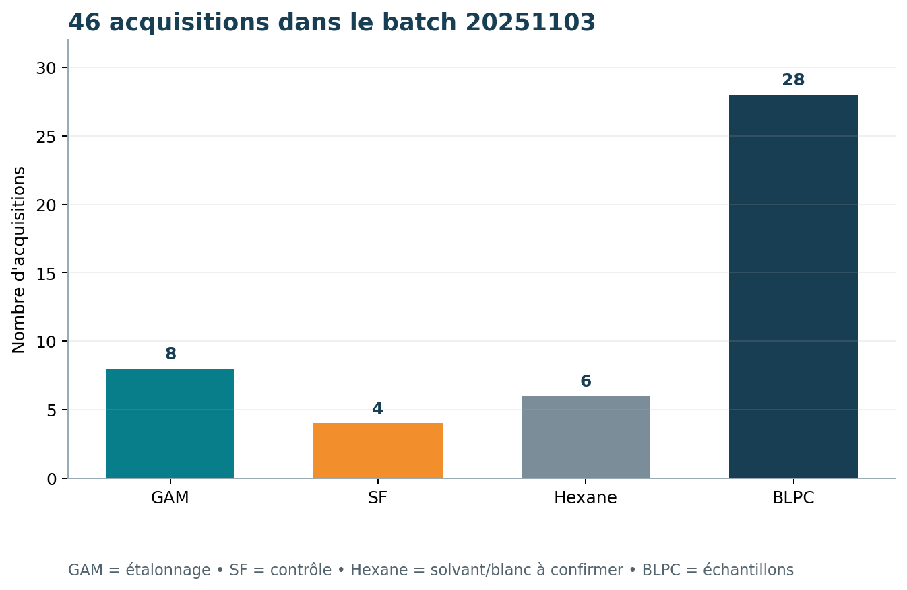
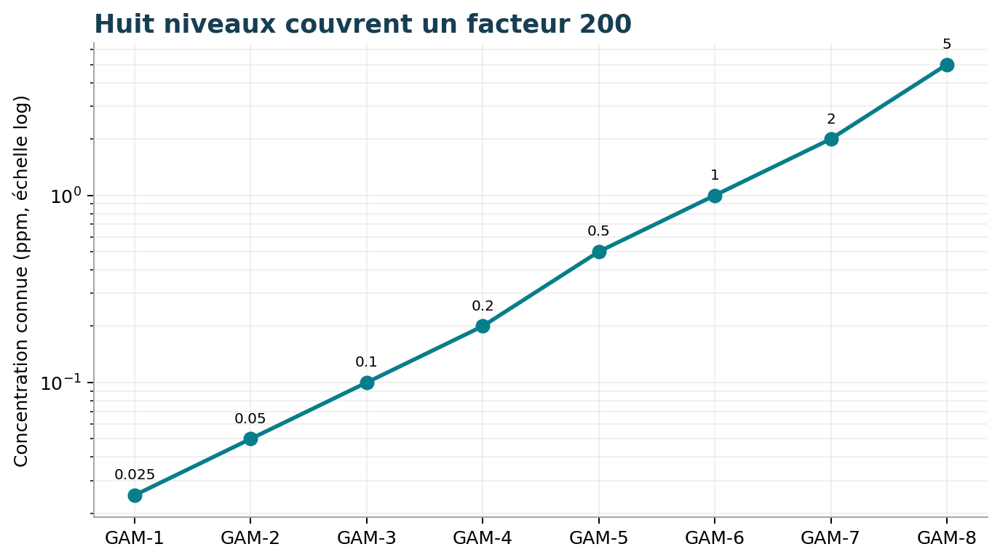
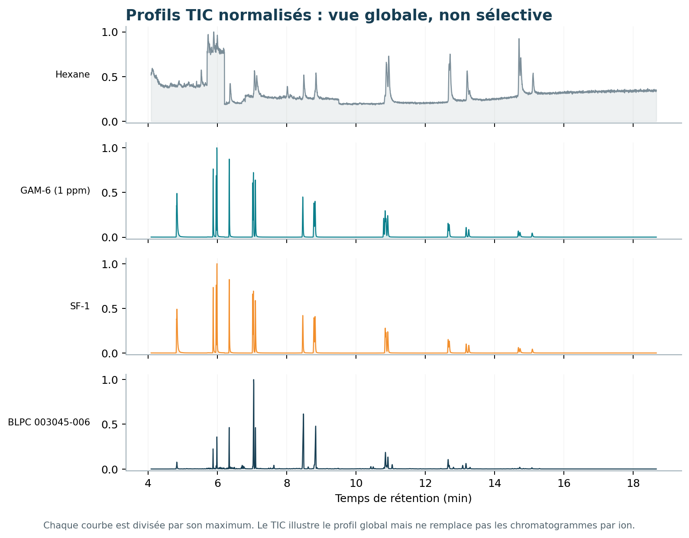
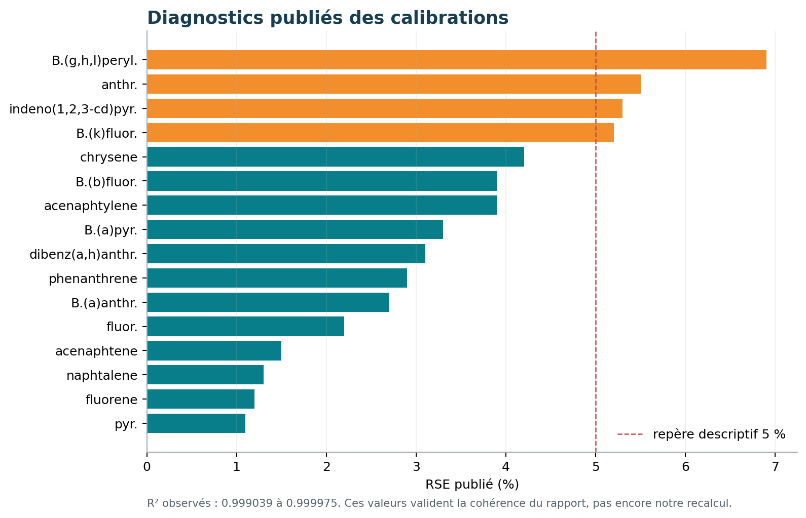

# Projet GCMS — Données nécessaires et structure exploitable

**Rendu du groupe 14 : 5 octobre 2026**

- Steve Landry KOUOKAM — chef de groupe
- Ludovic TUEKAM
- Radia GHILAS
- Harald MAFORIKAN
- Ismaila DIEYE

Ce document répond aux deux questions de cadrage sur lesquelles nous nous sommes appesantis : quelles informations extraire pour déterminer les concentrations des molécules toxiques connues, et comment organiser le projet pour rendre ces informations exploitables ?

## 1. Quelles données devons-nous extraire ?

Notre objectif est de déterminer la concentration des 16 hydrocarbures aromatiques polycycliques (HAP) ciblés par la méthode, dans une solution analysée par GC-MS. Nous devons relier les signaux mesurés à des molécules connues, puis convertir leur réponse en concentration grâce à une calibration vérifiée. [1, 2]

### Les informations indispensables

| Données nécessaires | Utilité | Source à exploiter |
| --- | --- | --- |
| Liste des 16 HAP, ions quantifiants et qualifiants | Savoir quelles molécules et quels canaux rechercher. | metadata.xlsx |
| Association de chaque HAP à son étalon interne (ISTD) | Corriger les variations de réponse par un ratio d’aires. | Feuille compound_deuterated |
| Séries temps / intensité pour chaque ion utile | Détecter les pics et calculer leurs aires, dans les GAM, SF et futurs échantillons. | Données MS des dossiers .D, à convertir |
| Identité, type, date, niveau et facteur de dilution | Relier chaque signal à la bonne acquisition et corriger la concentration. | sample_info.xml et journaux TSV |
| Concentrations connues des huit GAM | Établir la relation entre réponse normalisée et concentration. | Document GAM + rapport de calibration |
| Concentration nominale des SF | Vérifier la justesse du retour-calcul sur un contrôle connu. | Valeur de travail : 1 ppm, à confirmer comme valeur contractuelle avec le laboratoire |
| Ordre des pics et cas particuliers | Distinguer des molécules qui partagent les mêmes ions. | Métadonnées et méthode analytique |
| Tolérances et règles de traitement | Décider si l’identification et la quantification sont acceptables. | Paramètres métier à définir ou confirmer |

### Les repères à calculer à partir de ces données

Sur GAM-6, nous construirons les temps de rétention de référence, les bornes d’intégration et le ratio qualifiant/quantifiant attendu. Puis nous calculerons les aires des pics, les ratios composé/ISTD et les coefficients de calibration. Ces informations sont des résultats du traitement, pas toutes des colonnes déjà disponibles dans le ZIP. [1]

Un ion isolé ne suffit pas à identifier une molécule : nous devons croiser les deux canaux, leur temps de rétention et l’ordre des pics. Une concentration exploitable exige ensuite une calibration et un contrôle SF satisfaisants.

## 2. Comment comprenons-nous la structure ?

Nous distinguons la méthode analytique, les acquisitions instrumentales et les résultats du traitement. La méthode indique quoi chercher. Les acquisitions enregistrent les signaux. Le traitement transforme ces signaux en concentrations traçables.

### Les rôles des échantillons

| Échantillon | Rôle | Présence dans 20251103.zip |
| --- | --- | --- |
| GAM-6, parmi les GAM | Construire les repères de référence. | Un point à 1 ppm, inclus dans les 8 GAM |
| GAM-1 à GAM-8 | Calibrer chaque composé à partir de concentrations connues. | 8 acquisitions : 0,025 ; 0,05 ; 0,1 ; 0,2 ; 0,5 ; 1 ; 2 ; 5 ppm |
| SF | Vérifier la calibration sur une solution de contrôle. | 4 acquisitions, nominal de travail à 1 ppm |
| Hexane | Acquisitions de solvant, rôle précis de blanc à confirmer. | 6 acquisitions |
| BLPC | Appliquer ultérieurement la méthode à des échantillons de terrain. | 28 acquisitions, dont 3 avec suffixe d20 |

Le périmètre demandé par le cahier des charges est la référence, la calibration GAM et le contrôle SF. Les BLPC permettent de comprendre l’application finale, mais leur quantification n’est pas exigée dans ce périmètre. La référence est une acquisition GAM choisie, pas un neuvième étalon indépendant. [1, 3]

### Ce que contient réellement le ZIP brut

Le batch 20251103 regroupe 46 dossiers .D. Chaque dossier contient notamment des données MS natives (data.ms et fichiers BIN), des XML de métadonnées, la méthode instrumentale et un chromatogramme global tic_front.csv / tic_front.tsv. QuantReports contient 61 CSV de résultats et 8 PDF. QuantResults contient le batch binaire du logiciel. [3]

Les TIC globalisent le signal et ne fournissent pas séparément les intensités des ions 128 et 127, par exemple. Les CSV de résultats contiennent des valeurs déjà calculées par le laboratoire. Ils serviront à comparer notre futur traitement, mais ne remplacent pas les séries brutes par ion nécessaires pour automatiser l’intégration.

Le cahier des charges décrit un jeu préparé, cache_gam_sf.zip, avec cinq batchs et des fichiers mz_XXX.csv. Le ZIP exploré est un seul batch natif, plus large en types d’échantillons. Nous devons donc obtenir le jeu préparé ou convertir les canaux ioniques utiles de cette archive. [1, 3]

## 3. Une structure de données exploitable

Nous proposons de conserver les fichiers natifs intacts et de produire des tables séparées, reliées par batch_id, sample_id et compound_id. Les identifiants doivent distinguer chaque acquisition, notamment les réinjections diluées.

### Un modèle de données simple et traçable

| Table proposée | Informations à conserver |
| --- | --- |
| samples.csv | batch_id, sample_id, sample_type, gam_level, concentration_known_ppm, dilution_factor, acquisition_datetime, source_path |
| compounds.csv | compound_id, nom, type, quantifier_mz, qualifier_mz, istd_id, ordre des pics, double_peak, median_despike, domaine d’application |
| signals.parquet ou signals.csv | batch_id, sample_id, mz, time_min, intensity, unité du signal, source_path. Une ligne = une mesure d’un ion à un instant. |
| references.csv | batch_id, compound_id, reference_sample_id, canal, rt_ref_min, t_start_min, t_end_min, ratio_qual_quant_ref |
| peaks.parquet ou peaks.csv | batch_id, sample_id, compound_id, aires quantifiante / qualifiante / ISTD, temps et bornes d’intégration, ratios et anomalies |
| calibrations.csv | batch_id, compound_id, a, b, c, R², pondération, niveaux utilisés, domaine de calibration, statut |
| results.csv | batch_id, sample_id, compound_id, concentration_injected_ppm, dilution_factor, concentration_final_ppm, statut et raisons du contrôle |

### Une première conversion compatible avec le sujet

Une organisation batch / échantillon / mz_XXX.csv est également adaptée. Chaque fichier contiendrait exactement les colonnes time_min et intensity, avec les unités documentées. Un multiplier.txt ou une ligne de samples.csv porterait le facteur de dilution. Ces exports peuvent ensuite être regroupés dans la table signals. [1]

Exemple de chemin proposé : prepared/20251103/GAM-6/mz_128.csv. Il s’agit d’un format cible : ce fichier n’existe pas dans le ZIP brut. Les signaux extraits doivent correspondre aux ions acquis, ici notamment 128,1 et 127,1. Nous documenterons la correspondance avec les valeurs nominales 128 et 127 du classeur. [2, 3]

Le lecteur doit préserver les temps réellement enregistrés, car le pas temporel varie. Un canal SIM n’est mesuré que dans sa fenêtre d’acquisition : une valeur non acquise ne doit pas être remplacée automatiquement par zéro. Les noms de composés et les versions des exports doivent aussi être harmonisés et conservés.

## 4. Du signal à la concentration

La chaîne dépend de trois briques, dans cet ordre : construire la référence, calibrer avec les GAM, puis vérifier avec les SF. La mesure d’un échantillon inconnu vient ensuite. [1]

| Étape | Traitement prévu | Résultat |
| --- | --- | --- |
| 1. Référence GAM-6 | Repérer chaque composé sur ses deux ions. Déterminer l’apex et les bornes du pic. | Temps, fenêtres et ratio ionique de référence |
| 2. Intégration | Rechercher les pics voisins de la référence dans chaque GAM. Intégrer le signal selon une règle de ligne de base documentée. | Aires quantifiante, qualifiante et ISTD |
| 3. Normalisation | Diviser l’aire quantifiante du composé par l’aire de son ISTD associé. | Réponse normalisée r |
| 4. Calibration | Ajuster un polynôme de degré 2 sur les huit couples concentration connue / réponse. Examiner R² et résidus. | Une courbe par batch et par composé |
| 5. Contrôle SF | Intégrer les SF, inverser la calibration et comparer la concentration obtenue au nominal. | Conformité selon une tolérance justifiée |
| 6. Application | Appliquer la calibration vérifiée à une solution inconnue et tenir compte de sa dilution. | Concentration finale et statut de validité |

### Deux ratios différents, pour deux besoins

Identification : q = aire_qualifiante / aire_quantifiante. Nous comparons q au ratio de référence pour vérifier la cohérence du pic.

Quantification : r = aire_quantifiante_du_composé / aire_quantifiante_de_son_ISTD. C’est r que nous relions à la concentration C : r = a × C² + b × C + c.

Pour un nouvel échantillon, nous résolvons a × C² + b × C + (c - r) = 0. Nous retenons une solution positive, cohérente avec la branche et le domaine validés de la calibration. Une solution ambiguë, hors domaine ou non réelle doit produire un statut explicite, pas une concentration arbitraire.

La correction attendue est C_finale = C_solution_injectée × facteur_de_dilution, selon la définition validée du facteur. Nous conservons les deux concentrations. Un résultat déjà exporté et corrigé ne doit pas recevoir une seconde fois le multiplicateur. La conversion en concentration dans un sol ou un enrobé demanderait aussi les paramètres de préparation et les unités correspondantes.

## 5. Rendu attendu et informations à confirmer

Le résultat final doit répondre, pour chaque échantillon et chaque HAP ciblé : quel composé avons-nous recherché, son identification est-elle cohérente, quelle concentration estimons-nous et pouvons-nous utiliser cette valeur ?

### Une ligne de résultat par échantillon et par composé

| Information restituée | Contenu attendu |
| --- | --- |
| Identité et provenance | Batch, acquisition, composé, fichiers sources et version du traitement |
| Identification | Temps de rétention, deux ions, ratio ionique, anomalies éventuelles |
| Mesure | Aires intégrées et réponse normalisée composé/ISTD |
| Concentration | Valeur avant correction, facteur de dilution, valeur finale et unité |
| Validité | Calibration utilisée, contrôle SF, statut exploitable / à vérifier / non quantifiable, avec motif |

### Les points à préciser avant le calcul complet

Nous devons confirmer le moyen d’extraire les canaux MS, le nominal exact des SF, la tolérance de conformité et les règles d’intégration. Il faut aussi préciser le traitement des pics partagés, du double pic et du paramètre median_despike. Les notes indiquent des tolérances de ratio et de rétention de ±23 % et ±0,2 %, mais leurs conventions doivent être confirmées. [1, 2, 4]

Les rapports MassHunter montrent une calibration quadratique pondérée en 1/x pour les HAP. Cette information devra être prise en compte si nous cherchons à reproduire ces résultats. Un R² élevé ne suffit pas : les SF vérifient la justesse, et les contrôles d’identification vérifient la cohérence des molécules. [1, 3]

Une absence de pic exploitable doit rester distincte d’une concentration nulle ou d’une absence certaine de la molécule. Les seuils de détection et de quantification, s’ils sont requis, doivent être fournis ou justifiés.

### Notre compréhension à ce stade

Nous avons identifié les molécules ciblées, leurs ions, leurs étalons internes, les huit concentrations GAM et les métadonnées d’acquisition. Le travail restant consiste à extraire les signaux par ion, calculer les références et les aires, construire les calibrations puis valider les contrôles. Ce rendu présente les données nécessaires et notre organisation proposée ; il ne prétend pas avoir déjà recalculé les concentrations.

## 6. Visualisations qui appuient notre compréhension

Les graphiques ci-dessous ne calculent pas encore les concentrations finales. Ils servent à vérifier que nous comprenons correctement le lot de données et les étapes à réaliser.

### Répartition des acquisitions

Nous voyons que le lot contient surtout des acquisitions BLPC. Les GAM et les SF sont moins nombreux, mais ils sont essentiels : les GAM servent à construire la calibration et les SF servent à vérifier qu'elle donne un résultat juste sur une solution connue.

### Niveaux de la gamme d'étalonnage

Les huit niveaux ne sont pas espacés régulièrement. Les faibles concentrations sont rapprochées afin de mieux décrire le début de la courbe, tandis que les valeurs plus fortes étendent le domaine jusqu'à 5 ppm. Ce point justifie l'examen de la pondération et des résidus, et pas seulement du coefficient R².

### Exemple de chromatogrammes TIC

Un TIC additionne plusieurs ions. Il permet de voir l'allure générale de l'acquisition, mais il ne permet pas à lui seul d'identifier correctement chacun des 16 HAP. Pour le calcul demandé, nous devons travailler sur les canaux ioniques associés aux composés.

### Diagnostics attendus pour les calibrations

Pour chaque composé, nous devrons représenter les points GAM, la courbe ajustée, les résidus et le retour-calcul des contrôles SF. Une calibration n'est pas jugée seulement avec une courbe visuellement proche des points : elle doit aussi donner des contrôles acceptables.

### Sources utilisées

[1] projet_optimisation_operationnel.pdf, sections 2 à 5, pages 2 à 5. [2] metadata.xlsx, feuilles compound_informations et compound_deuterated. [3] 20251103.zip : données natives, sample_info.xml, journaux de séquence, acqmeth.txt et QuantReports. [4] concentration point de GAM.docx, Notes sujet GCMS à automatiser.md et Explication GCMS.excalidraw. Les constats sur l’archive proviennent de l’exploration réalisée le 5 octobre 2026.

## Annexe. Les 16 molécules ciblées

Les valeurs ci-dessous reproduisent la méthode fournie dans metadata.xlsx. Elles indiquent les m/z nominaux. Les acquisitions instrumentales comportent des valeurs décimales correspondantes. [2, 3]

| Composé | m/z quant. | m/z qual. | Étalon interne associé |
| --- | --- | --- | --- |
| Naphtalene | 128 | 127 | Naphtalene-D8 |
| Acenaphtylene | 152 | 153 | Naphtalene-D8 |
| Acenaphtene | 153 | 154 | Acenaphtene-D10 |
| Fluorene | 166 | 165 | Acenaphtene-D10 |
| Phenanthrene | 178 | 176 | Phenanthrene-D10 |
| Anthracene | 178 | 176 | Phenanthrene-D10 |
| Fluoranthene | 202 | 101 | Phenanthrene-D10 |
| Pyrene | 202 | 101 | Phenanthrene-D10 |
| Benzo(a)anthracene | 228 | 226 | Phenanthrene-D10 |
| Chrysene | 228 | 226 | Chrysene-D12 |
| Benzo(b)fluoranthene | 252 | 253 | Chrysene-D12 |
| Benzo(k)fluoranthene | 252 | 253 | Chrysene-D12 |
| Benzo(a)pyrene | 252 | 253 | Chrysene-D12 |
| Dibenz(a,h)anthracene | 278 | 279 | Chrysene-D12 |
| Indeno(1,2,3-cd)pyrene | 276 | 277 | Chrysene-D12 |
| Benzo(g,h,l)perylene | 276 | 277 | Chrysene-D12 |

### Les points particuliers de la méthode

Phenanthrene et Anthracene partagent 178/176 ; Fluoranthene et Pyrene partagent 202/101 ; Benzo(a)anthracene et Chrysene partagent 228/226. Plusieurs composés partagent 252/253 ou 276/277. Le temps de rétention, l’ordre et les fenêtres d’intégration restent nécessaires pour les distinguer.

Benzo(b)fluoranthene et Benzo(k)fluoranthene portent un ordre de coélution 0 puis 1. Dibenz(a,h)anthracene comporte double_peak = True. Indeno(1,2,3-cd)pyrene comporte median_despike = 1. Nous devons conserver ces paramètres dans la table de méthode et définir leur effet dans le traitement.

Les quatre ISTD sont Naphtalene-D8 (136/135), Acenaphtene-D10 (164/162), Phenanthrene-D10 (188/187) et Chrysene-D12 (240/236). Le classeur décrit aussi deux surrogats actifs pour GAM/BLPC et un surrogat inutilisé ; leur rôle de suivi doit être distingué de la normalisation par les ISTD.
